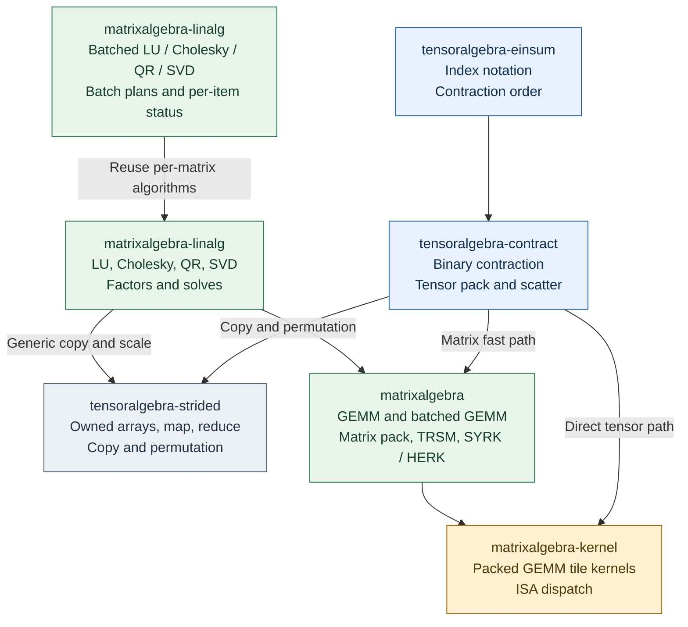
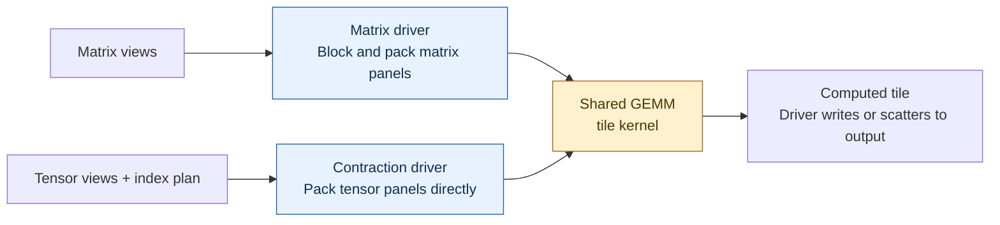
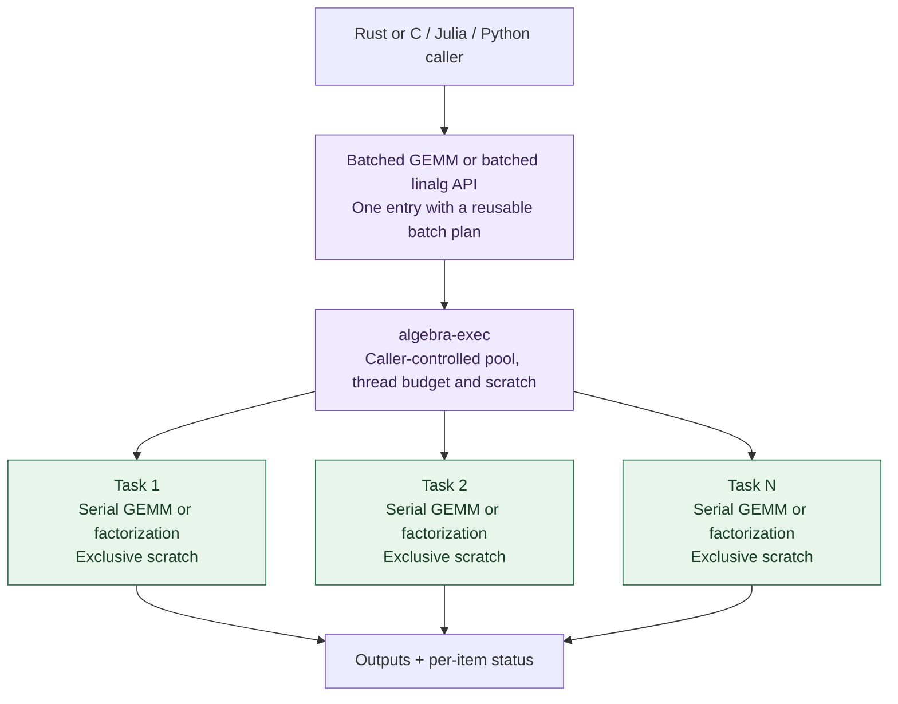
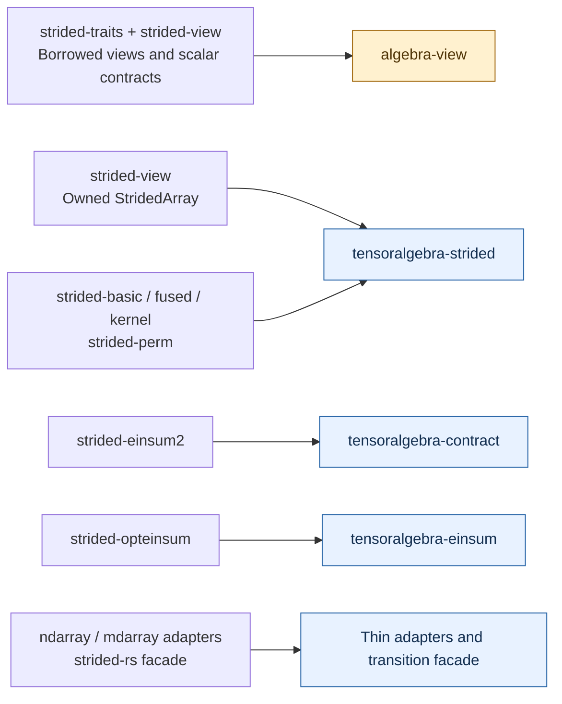

# tensoralgebra-rs

An experimental design for a tensor4all CPU algebra stack: tensor contraction,
GEMM, and batched dense linear algebra. AI-assisted contributions are welcome.

**Status:** design and experiments; no stable API or performance claim.
The names below describe proposed responsibilities. Modules can become separate
crates when experiments establish useful boundaries.

## Who owns what?

**Arrows mean “depends on.”** This diagram shows the computation layers;
shared view and execution contracts are listed just below it.
Colors indicate responsibilities: blue for tensor operations, green for matrix
operations, gray for shared strided kernels, and gold for GEMM tile kernels.
Repository boundaries remain provisional.

The two linalg nodes are responsibilities within **one crate**: batch APIs own
batch plans, workspace sizing and per-item status; per-matrix routines own the
numerical algorithms. Both use `algebra-exec` for explicit execution and scratch.

| Shared foundation | Responsibility |
| --- | --- |
| `algebra-view` | Checked borrowed views, strides, scalar and conjugation contracts. Shared by matrix and tensor layers. |
| `algebra-exec` | Explicit executor, thread budget, scratch planning and lifetime. Used by operation drivers; the tile kernel has no scheduler. |

`tensoralgebra-strided` is a reusable lower-level kernel layer. Contraction uses
its copy/permutation operations when a plan selects materialization; einsum
uses them through contraction. Linalg can reuse generic copy and scale operations,
and frontends can call elementwise, broadcast and reduction kernels directly.
Strided kernels depend on views and execution contracts, never on contraction
or factorization algorithms. Their kernels accept borrowed views; owned-array
helpers do not require backend operations to allocate.

In a future repository split, shared strided kernels, views and execution must
sit below both matrix and tensor operations, in the lower workspace or an
independent foundation workspace. The provisional `tensoralgebra-` prefix does
not imply an upper-layer dependency. Tenferro continues to own AD, traced
execution, device transfer and GPU backends. Adapters sit above the shared stack.

## The shared GEMM kernel

**Arrows here show data flow.** Matrix GEMM and direct tensor contraction have
different packers and drivers, but can use the same packed tile kernel.

This follows the [BLIS](https://www.cs.utexas.edu/~flame/pubs/blis1_toms_rev3.pdf)
and [TBLIS](https://arxiv.org/html/1607.00291v4) separation of packing and tile
computation. A contraction plan selects a compatible matrix-view fast path,
direct tensor packing, or explicitly reported materialization. Provider choice
and access to a usable low-level kernel interface remain experiments.
Direct panel packing stays with the contraction driver; a full copy or
permutation uses the shared strided layer. Specialized packing should not be
forced through a generic elementwise API.

## Factorizations and batches

`matrixalgebra-linalg` owns each decomposition's numerical algorithm and error
semantics. Matrix primitives accelerate its updates.

| Operation | Algorithm owned by linalg | Reused matrix work |
| --- | --- | --- |
| Cholesky | Panel factorization and definiteness checks | TRSM, SYRK / HERK |
| LU | Pivot selection, row swaps and factor storage | TRSM, GEMM |
| QR | Householder reflectors and compact block representation | Matrix products and trailing updates |
| SVD | Scaling, bidiagonal reduction, solver and convergence | Matrix products and vector transformations |

SVD requires its own accuracy and convergence work. Start with a validated
provider or serial implementation. See [algorithm details and LAPACK sources](docs/architecture.md#matrix-decompositions).

**Batched execution starts with one serial operation per matrix:**

Tasks run on a bounded set of workers; each worker can reuse scratch between
tasks. For a small batch of large matrices, measure inner-matrix parallelism
instead. Both levels share one thread budget. A barrier-driven inner contraction
needs a suitable synchronization contract; arbitrary pool submission is insufficient.

Batched GEMM stays beside GEMM; batched decompositions stay beside their scalar
operations in `matrixalgebra-linalg`. Reusing a serial routine per item is the
first implementation; specialized small-matrix or interleaved batch algorithms
can replace it behind the same batch contract after validation and measurement.
C callers need an explicit handle or callback contract for execution
and scratch. [Execution rationale and primary sources](docs/architecture.md#batched-execution).

## Where does strided-rs go?

**Arrows mean proposed migration, not dependencies.** Integration includes
redesigning responsibilities and preserving tested semantics.

Keep current consumers pinned until correctness and performance are verified.
Preserve upstream attribution and file-level licenses when moving code or tests.
[Migration details](docs/architecture.md#integrating-and-redesigning-strided-rs).

## What do we try first?

| Prototype | Question to resolve |
| --- | --- |
| Executor and FFI | Can a host reuse its executor and scratch with low entry cost? |
| Small GEMM and linalg | Which batch layouts, kernels and parallel axes win? |
| Direct tensor contraction | When does direct pack/scatter beat materialization plus GEMM? |

The motivating [FFI measurement](https://github.com/tensor4all/tenferro-rs/issues/1945)
reported roughly 8–14 µs session entry on one EPYC configuration. It is a measured
case to investigate, not a general FFI cost or a result of this project.

Read the [experiment protocol](docs/experiments.md),
[detailed design and implementation order](docs/architecture.md),
[research map](docs/research-map.md), and [decision log](docs/decision-log.md).
Contributions should include attributable sources, numerical checks and
reproducible evidence for performance claims; see the [provenance policy](docs/provenance.md).

No source migration, backend repository creation or repository transfer has been
performed. The repository license is pending a maintainer choice.
