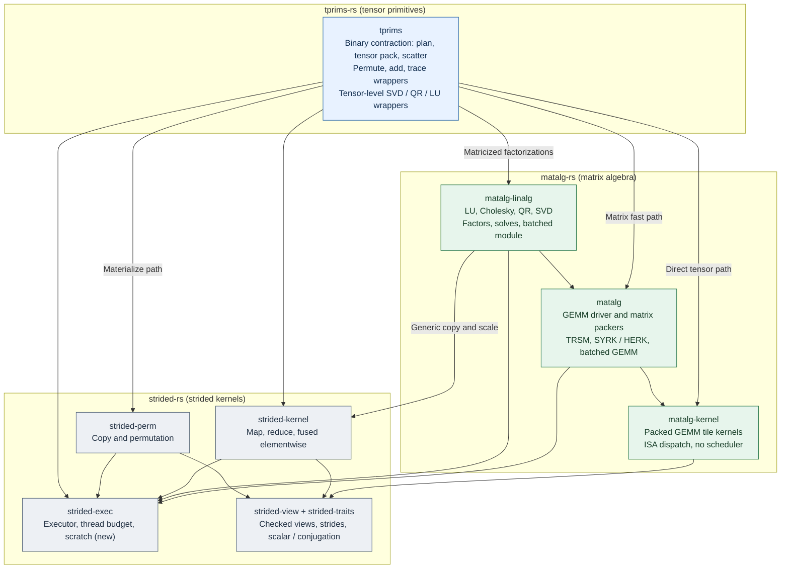
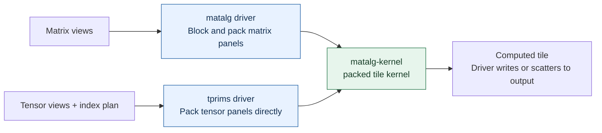
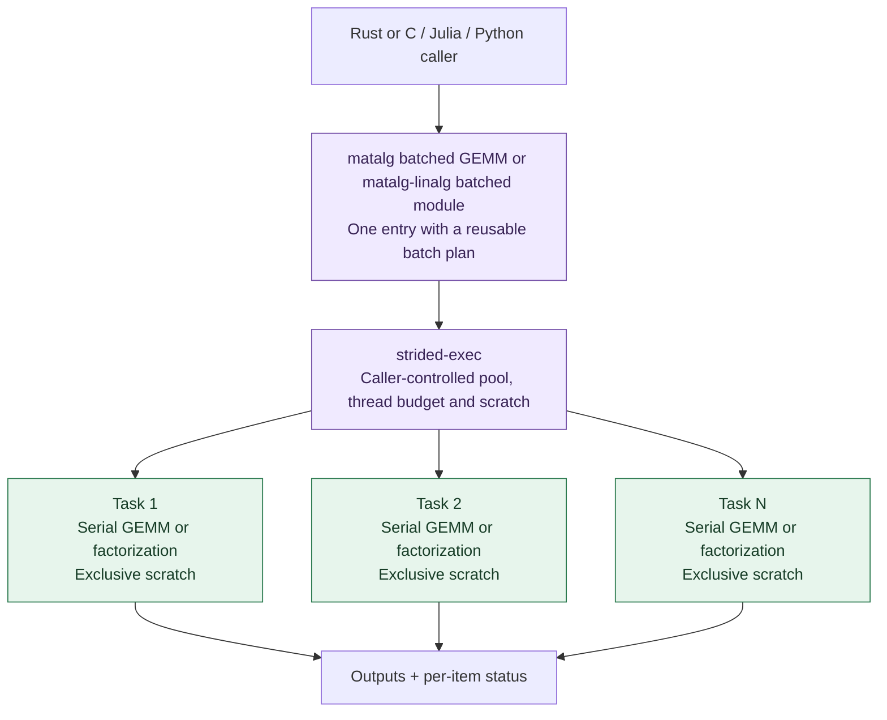
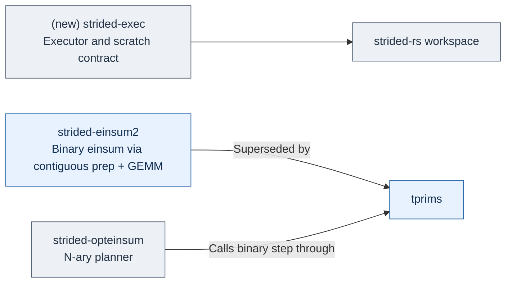

# tprims-rs

An experimental design for a tensor4all CPU algebra stack in three layers:
strided kernels, matrix algebra, and tensor primitives. AI-assisted
contributions are welcome.

**Status:** design and experiments; no stable API or performance claim.
The names below describe proposed responsibilities. Crates can be created when
experiments establish useful boundaries. This repository currently holds only
design notes; the repository name is provisional.

## Three layers, one direction of dependency

**Arrows mean "depends on."** Each layer is an independent workspace. The lower
layers never depend on the upper ones. Colors indicate layers: blue for tensor
primitives, green for matrix algebra, gray for strided kernels.

| Layer | Workspace | Crates | Owns |
| --- | --- | --- | --- |
| Strided kernels | `strided-rs` (existing) | `strided-traits`, `strided-view`, `strided-perm`, `strided-kernel`, `strided-exec` (new) | Checked borrowed views, scalar and conjugation contracts, copy and permutation, map / reduce / fused elementwise, explicit executor and scratch. No algebra. |
| Matrix algebra | `matalg-rs` (new) | `matalg-kernel`, `matalg`, `matalg-linalg` | Packed tile kernel, GEMM driver and BLAS-like operations, dense factorizations. Batched GEMM lives in `matalg`; batched factorizations are a module in `matalg-linalg`. |
| Tensor primitives | `tprims-rs` (this repository) | `tprims` | Binary contraction (`tensordot` / `dot_general`) with plan, tensor panel packing and scatter. Thin wrappers for permute, add, trace and tensor-level factorizations. No numerical algorithm of its own. |

**What is deliberately excluded.** N-ary index notation and contraction-order
planning (einsum) are not part of this stack. They stay in `strided-opteinsum`
or in the frontend that needs them, and call `tprims` for each binary step.
Tenferro continues to own AD, traced execution, device transfer and GPU
backends. Adapters for `ndarray` / `mdarray` sit above the stack.

**Why the lowest layer is `strided-rs`.** The existing `strided-view` and
`strided-traits` already provide checked borrowed views with lazy conjugation.
Instead of a new `algebra-view`, the stack reuses them and adds one crate,
`strided-exec`, for the caller-owned executor, thread budget and scratch
contract. Every kernel in the two upper layers takes that execution context
explicitly. No layer introduces an ambient global pool.

## The shared GEMM kernel

**Arrows here show data flow.** Matrix GEMM and direct tensor contraction have
different packers and drivers, but use the same packed tile kernel in
`matalg-kernel`.

This follows the [BLIS](https://www.cs.utexas.edu/~flame/pubs/blis1_toms_rev3.pdf)
and [TBLIS](https://arxiv.org/html/1607.00291v4) separation of packing and tile
computation. A `tprims` contraction plan selects one of three paths: collapse
compatible strides to a matrix view and call `matalg` GEMM without copying;
pack bounded tensor panels directly into the `matalg-kernel` format and scatter
irregular output tiles; or explicitly materialize operands through
`strided-perm` when the extra bytes are worth the GEMM speed. Full-tensor
materialization must be reported as a selected strategy. Provider choice and
access to a usable low-level kernel interface remain experiments.

## Factorizations and batches

`matalg-linalg` owns each decomposition's numerical algorithm and error
semantics. `matalg` primitives accelerate its updates. `tprims` exposes
tensor-level factorizations only as matricize, call `matalg-linalg`, reshape
back; it holds no pivoting, convergence or scaling logic.

| Operation | Algorithm owned by `matalg-linalg` | Reused `matalg` work |
| --- | --- | --- |
| Cholesky | Panel factorization and definiteness checks | TRSM, SYRK / HERK |
| LU | Pivot selection, row swaps and factor storage | TRSM, GEMM |
| QR | Householder reflectors and compact block representation | Matrix products and trailing updates |
| SVD | Scaling, bidiagonal reduction, solver and convergence | Matrix products and vector transformations |

SVD requires its own accuracy and convergence work. Start with a validated
provider or serial implementation. See [algorithm details and LAPACK sources](docs/architecture.md#matrix-decompositions).

**Batched execution starts with one serial operation per matrix:**

Tasks run on a bounded set of workers; each worker can reuse scratch between
tasks. For a small batch of large matrices, measure inner-matrix parallelism
instead. Both levels share one thread budget. A barrier-driven inner contraction
needs a suitable synchronization contract; arbitrary pool submission is
insufficient.

Batched GEMM stays beside GEMM in `matalg`; batched decompositions are a module
of `matalg-linalg`, not a separate crate. Reusing a serial routine per item is
the first implementation; specialized small-matrix or interleaved batch
algorithms can replace it behind the same batch contract after validation and
measurement. C callers need an explicit handle or callback contract for
execution and scratch. [Execution rationale and primary sources](docs/architecture.md#batched-execution).

## What happens to strided-rs?

`strided-rs` stays where it is and becomes the foundation layer. Only two
changes are proposed. **Arrows mean proposed change, not dependencies.**

`strided-view`, `strided-traits`, `strided-perm` and `strided-kernel` are
reused as they are, with execution and scratch made explicit where they are
currently ambient. Keep current consumers pinned until correctness and
performance are verified. Preserve upstream attribution and file-level licenses
when moving code or tests. [Migration details](docs/architecture.md#relationship-to-strided-rs).

## What do we try first?

| Prototype | Question to resolve |
| --- | --- |
| Executor and FFI | Can a host reuse its executor and scratch with low entry cost? |
| Small GEMM and linalg | Which batch layouts, kernels and parallel axes win? |
| Direct tensor contraction | When does direct pack/scatter beat materialization plus GEMM? |

The motivating [FFI measurement](https://github.com/tensor4all/tenferro-rs/issues/1945)
reported roughly 8–14 µs session entry on one EPYC configuration. It is a measured
case to investigate, not a general FFI cost or a result of this project.

Read the [experiment protocol](docs/experiments.md),
[detailed design and implementation order](docs/architecture.md),
[research map](docs/research-map.md), and [decision log](docs/decision-log.md).
Contributions should include attributable sources, numerical checks and
reproducible evidence for performance claims; see the [provenance policy](docs/provenance.md).

No source migration, backend repository creation or repository transfer has been
performed. The repository license is pending a maintainer choice.
