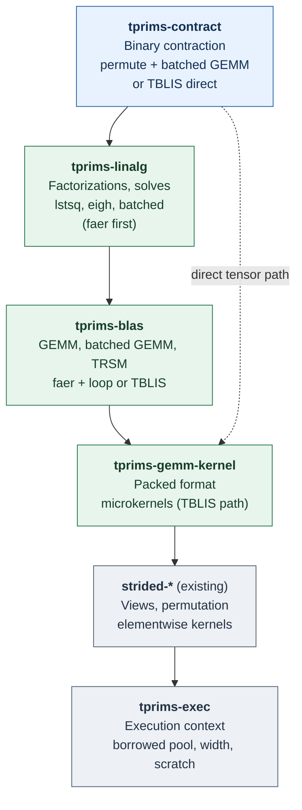
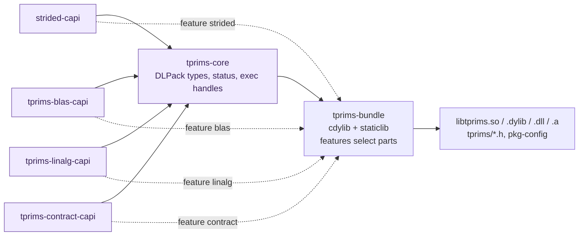

# tprims-rs

An experimental design for a CPU algebra stack built from independent parts:
an explicit execution context, strided kernels, a GEMM microkernel, BLAS-like
matrix operations, dense linear algebra, and binary tensor contraction. Each
part is a separate crate that can be used on its own; there is no facade. A C
ABI can be built from any subset of parts into a single shared library,
`libtprims`, with zero-copy DLPack-compatible data exchange. AI-assisted
contributions are welcome.

**Status:** design and experiments; no stable API, ABI or performance claim.
This repository holds design notes and small measurement experiments under `experiments/`.

**Design principles** ([full text](docs/design-principles.md)): parts, not a
facade; one direction of dependency; short names under the `tprims-` prefix;
a C ABI per part, linked into one library per build; zero copy through
DLPack; no hidden copies, threads or allocation; the host owns execution;
correctness before measurement, measurement before optimization.

## Parts, not a facade

**Arrows mean "depends on."** Only the nearest dependency of each part is
drawn; the dashed arrow marks the one direct dependency that matters for the
design. Every part except `tprims-gemm-kernel` also takes `tprims-exec`
directly. [Full dependency list](docs/architecture.md#crates). Rust crates
carry no C symbols. Each C ABI crate is an `rlib` owned by the part it
exposes; only `tprims-bundle` produces a shared or static library.



| Crate | Owns | C ABI crate |
| --- | --- | --- |
| `tprims-exec` | Execution context: serial, a Rayon pool borrowed from the host (or created by a C host), host scheduling callbacks; width chosen from work; reusable scratch. No ambient global pool. | `tprims-core` |
| `strided-*` (existing, [strided-rs](https://github.com/tensor4all/strided-rs)) | Checked strided views, scalar and conjugation contracts, copy and permutation, map / reduce / fused elementwise. | `strided-capi` |
| `tprims-gemm-kernel` | Packed A/B panel format and register-tile microkernels for the TBLIS-style path, initially ported from tensorprimitives-rs. No scheduler, no full-matrix API. | none |
| `tprims-blas` | GEMM and batched GEMM (faer plus a loop over items, or TBLIS-style; compared), TRSM, later SYRK / HERK. | `tprims-blas-capi` |
| `tprims-linalg` | LU, Cholesky, LDLᴴ, QR, SVD, symmetric / Hermitian eigendecomposition; solves on factor objects, `solve`, `lstsq`, `inv`, `det`; `batched` module. faer per item first. | `tprims-linalg-capi` |
| `tprims-contract` | Binary contraction with batch indices (`dot_general` semantics) with two strategies to compare: permute plus batched GEMM (from tenferro-rs) and TBLIS-style direct (from tensorprimitives-rs); thin permute / add / trace wrappers. | `tprims-contract-capi` |

Crate, header and symbol names map one to one: `tprims-blas` exposes
`tprims/blas.h` and `tprims_blas_*`. A Rust user who prefers short paths can
rename on import, for example `blas = { package = "tprims-blas" }`.

**Deliberately excluded:** N-ary einsum and contraction-order planning (they
stay in `strided-opteinsum` or the frontend and call `tprims-contract` per
binary step); iterative Krylov solvers (deferred, see the
[decision log](docs/decision-log.md)); AD, tracing, device transfer and GPU
backends.

## One shared library from the parts you need



```sh
cargo build --release -p tprims-bundle --features blas,contract
```

Every part links into one library, so handles such as an executor created by
`tprims_exec_rayon_create` are valid in every other part's calls. Separate
per-part shared libraries are not supported: they would duplicate Rust types,
Rayon runtimes and, for static libraries, the Rust standard library symbols.
A 2026-09-29 local prototype confirmed that `#[no_mangle]` functions defined
in feature-selected `rlib` dependencies are exported from the bundle and that
a handle created by one part is accepted by another.

## Zero-copy data exchange with DLPack

- Operands are borrowed `DLTensor*` descriptors: data pointer, `byte_offset`,
  shape and element strides, including column-major and negative strides. No
  input is copied at the boundary, so NumPy, PyTorch, JAX and Julia arrays
  pass through unchanged.
- Results are written either into a caller-provided `DLTensor`
  (`C = alpha * op(A, B) + beta * C`) or returned as a library-allocated
  `DLManagedTensorVersioned` (DLPack 1.x) with a deleter, for outputs whose
  size the library determines, such as factors.
- Conjugation is a per-operand argument because DLPack has no conjugation
  flag. A `READ_ONLY` versioned tensor is rejected as an output.
- If a stride layout would require internal materialization, the call reports
  the selected strategy; `TPRIMS_NO_MATERIALIZE` turns that case into an
  error instead of a hidden copy.

## Caller-owned execution

```c
tprims_exec *tprims_exec_serial(void);
tprims_exec *tprims_exec_rayon_create(size_t nthreads, const tprims_rayon_opts *opts);
tprims_exec *tprims_exec_from_callbacks(const tprims_exec_vtable *host);
size_t       tprims_exec_num_threads(const tprims_exec *exec);
tprims_status tprims_exec_set_budget(tprims_exec *exec, size_t max_threads);
tprims_status tprims_exec_close(tprims_exec *exec);   /* joins all workers */
void         tprims_exec_retain(tprims_exec *exec);
void         tprims_exec_release(tprims_exec *exec);
```

Every expensive operation takes an explicit `tprims_exec`. Rust callers pass an `Exec` that borrows the host's Rayon pool, for example the pool of tenferro-rs, for the duration of the call. Serial work runs on the calling thread without entering any pool; only a kernel that runs in parallel enters the pool, and not at all if the caller is already one of its workers. With that rule an entry cost of about 10 µs is acceptable ([measurement](experiments/rayon-entry/README.md)): work below roughly 50 to 100 µs runs serially, and a kernel picks its width from its work so that full-width fan-out (55 to 200 µs at 18 threads) is paid only by large kernels ([cost model](docs/architecture.md#cost-of-parallel-execution)). faer can therefore serve as the first backend. `close` is synchronous: dropping a Rayon `ThreadPool` only terminates threads asynchronously, so the handle waits for all workers through an exit handler, and returns `TPRIMS_BUSY` while work is in flight. [Details](docs/architecture.md#execution-context).

## Two contraction strategies, compared

`tprims-contract` ports two existing implementations behind one plan API: tenferro-rs's permute plus batched GEMM, and the [TBLIS](https://arxiv.org/abs/1607.00291)-style direct contraction of Lukas Devos's [tensorprimitives-rs](https://github.com/lkdvos/tensorprimitives-rs), which packs general strides straight into microkernel panels and scatters output tiles. Batched GEMM likewise has two implementations, faer plus a loop over items and the TBLIS-style kernel. Measurement decides which one a plan selects for which shapes. Ported code keeps its authorship, history and license notices.

## Phase 1: a tenferro-rs CPU backend

| Step | Content |
| --- | --- |
| 1a | `tprims-exec`: borrowed pool, width from work, kernel-level entry, `broadcast(n, f)` |
| 1b | `tprims-blas`: GEMM, batched GEMM (faer + loop, TBLIS), TRSM |
| 1c | `tprims-contract`: permute + batched GEMM and TBLIS direct, compared |
| 1d | `tprims-linalg`: faer per item plus batched loops, covering tenferro's CPU linear algebra |
| 1e | tenferro-rs integration behind a feature, with A/B correctness and a same-run performance gate |
| 1f | A thin C ABI slice (core, blas, contract, bundle) and C benchmarks, to test the design across the C boundary early |

Full C ABI coverage is Phase 2. [Full plan](docs/architecture.md#implementation-order).

The motivating [FFI measurement](https://github.com/tensor4all/tenferro-rs/issues/1945)
reported roughly 8 to 14 µs session entry on one EPYC configuration. It is a
measured case to investigate, not a general FFI cost or a result of this
project.

Read the [design principles](docs/design-principles.md),
[detailed design](docs/architecture.md),
[experiment protocol](docs/experiments.md),
[research map](docs/research-map.md) and [decision log](docs/decision-log.md).
Contributions should include attributable sources, numerical checks and
reproducible evidence for performance claims; see the
[provenance policy](docs/provenance.md).

No source migration or crate publication has been performed. The repository
license is pending a maintainer choice.
