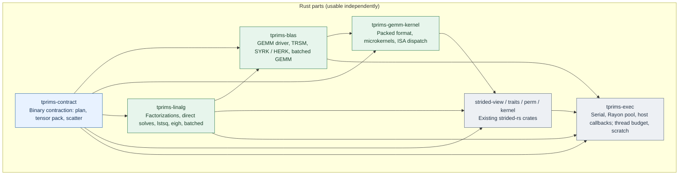
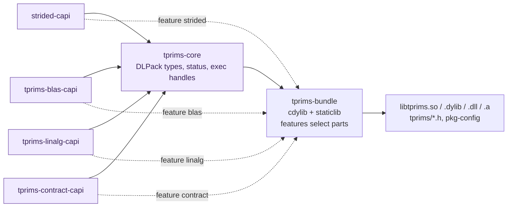

# tprims-rs

An experimental design for a CPU algebra stack built from independent parts:
an explicit execution context, strided kernels, a GEMM microkernel, BLAS-like
matrix operations, dense linear algebra, and binary tensor contraction. Each
part is a separate crate that can be used on its own; there is no facade. A C
ABI can be built from any subset of parts into a single shared library,
`libtprims`, with zero-copy DLPack-compatible data exchange. AI-assisted
contributions are welcome.

**Status:** design and experiments; no stable API, ABI or performance claim.
This repository currently holds only design notes.

**Design principles** ([full text](docs/design-principles.md)): parts, not a
facade; one direction of dependency; short names under the `tprims-` prefix;
a C ABI per part, linked into one library per build; zero copy through
DLPack; no hidden copies, threads or allocation; the host owns execution;
correctness before measurement, measurement before optimization.

## Parts, not a facade

**Arrows mean "depends on."** Rust crates carry no C symbols. Each C ABI crate
is an `rlib` owned by the part it exposes; only `tprims-bundle` produces a
shared or static library.



| Crate | Owns | C ABI crate |
| --- | --- | --- |
| `tprims-exec` | Execution context: serial, caller-owned Rayon pool, host scheduling callbacks; thread budget; reusable scratch. No ambient global pool. | `tprims-core` |
| `strided-*` (existing, [strided-rs](https://github.com/tensor4all/strided-rs)) | Checked strided views, scalar and conjugation contracts, copy and permutation, map / reduce / fused elementwise. | `strided-capi` |
| `tprims-gemm-kernel` | Packed A/B panel format and register-tile microkernels. No scheduler, no full-matrix API. | none |
| `tprims-blas` | GEMM driver and matrix packers, TRSM, SYRK / HERK, batched GEMM. | `tprims-blas-capi` |
| `tprims-linalg` | LU, Cholesky, LDLᴴ, QR, SVD, symmetric / Hermitian eigendecomposition; solves on factor objects, `solve`, `lstsq`, `inv`, `det`; `batched` module. | `tprims-linalg-capi` |
| `tprims-contract` | Binary contraction with batch indices (`dot_general` semantics); thin permute / add / trace wrappers. | `tprims-contract-capi` |

Crate, header and symbol names map one to one: `tprims-blas` exposes
`tprims/blas.h` and `tprims_blas_*`. A Rust user who prefers short paths can
rename on import, for example `blas = { package = "tprims-blas" }`.

**Deliberately excluded:** N-ary einsum and contraction-order planning (they
stay in `strided-opteinsum` or the frontend and call `tprims-contract` per
binary step); iterative Krylov solvers (deferred, see the
[decision log](docs/decision-log.md)); AD, tracing, device transfer and GPU
backends.

## One shared library from the parts you need



```sh
cargo build --release -p tprims-bundle --features blas,contract
```

Every part links into one library, so handles such as an executor created by
`tprims_exec_rayon_create` are valid in every other part's calls. Separate
per-part shared libraries are not supported: they would duplicate Rust types,
Rayon runtimes and, for static libraries, the Rust standard library symbols.
A 2026-09-29 local prototype confirmed that `#[no_mangle]` functions defined
in feature-selected `rlib` dependencies are exported from the bundle and that
a handle created by one part is accepted by another.

## Zero-copy data exchange with DLPack

- Operands are borrowed `DLTensor*` descriptors: data pointer, `byte_offset`,
  shape and element strides, including column-major and negative strides. No
  input is copied at the boundary, so NumPy, PyTorch, JAX and Julia arrays
  pass through unchanged.
- Results are written either into a caller-provided `DLTensor`
  (`C = alpha * op(A, B) + beta * C`) or returned as a library-allocated
  `DLManagedTensorVersioned` (DLPack 1.x) with a deleter, for outputs whose
  size the library determines, such as factors.
- Conjugation is a per-operand argument because DLPack has no conjugation
  flag. A `READ_ONLY` versioned tensor is rejected as an output.
- If a stride layout would require internal materialization, the call reports
  the selected strategy; `TPRIMS_NO_MATERIALIZE` turns that case into an
  error instead of a hidden copy.

## Caller-owned execution

```c
tprims_exec *tprims_exec_serial(void);
tprims_exec *tprims_exec_rayon_create(size_t nthreads, const tprims_rayon_opts *opts);
tprims_exec *tprims_exec_from_callbacks(const tprims_exec_vtable *host);
size_t       tprims_exec_num_threads(const tprims_exec *exec);
tprims_status tprims_exec_set_budget(tprims_exec *exec, size_t max_threads);
tprims_status tprims_exec_close(tprims_exec *exec);   /* joins all workers */
void         tprims_exec_retain(tprims_exec *exec);
void         tprims_exec_release(tprims_exec *exec);
```

Every expensive operation takes an explicit `tprims_exec`. Rust callers use
the same context from `tprims-exec`. `close` is synchronous: dropping a Rayon
`ThreadPool` only terminates threads asynchronously, so the handle waits for
all workers through an exit handler, and returns `TPRIMS_BUSY` while work is
in flight. [Details](docs/architecture.md#execution-context).

## The shared GEMM kernel

Matrix GEMM and direct tensor contraction use different packers and drivers
but the same packed tile kernel, following the
[BLIS](https://www.cs.utexas.edu/~flame/pubs/blis1_toms_rev3.pdf) and
[TBLIS](https://arxiv.org/html/1607.00291v4) separation of packing and tile
computation. A `tprims-contract` plan selects one of three paths: collapse
compatible strides to a matrix view and call `tprims-blas` GEMM without
copying; pack bounded tensor panels directly into the `tprims-gemm-kernel`
format and scatter irregular output tiles; or explicitly materialize operands
through `strided-perm`. Provider choice remains an experiment.

## What do we try first?

| Prototype | Question to resolve |
| --- | --- |
| Execution context and C ABI | Can a C host create, reuse and close a pool with low entry cost, across parts in one bundle? |
| Small GEMM and linalg | Which batch layouts, kernels and parallel axes win? |
| Direct tensor contraction | When does direct pack / scatter beat materialization plus GEMM? |

The motivating [FFI measurement](https://github.com/tensor4all/tenferro-rs/issues/1945)
reported roughly 8 to 14 µs session entry on one EPYC configuration. It is a
measured case to investigate, not a general FFI cost or a result of this
project.

Read the [design principles](docs/design-principles.md),
[detailed design](docs/architecture.md),
[experiment protocol](docs/experiments.md),
[research map](docs/research-map.md) and [decision log](docs/decision-log.md).
Contributions should include attributable sources, numerical checks and
reproducible evidence for performance claims; see the
[provenance policy](docs/provenance.md).

No source migration or crate publication has been performed. The repository
license is pending a maintainer choice.
