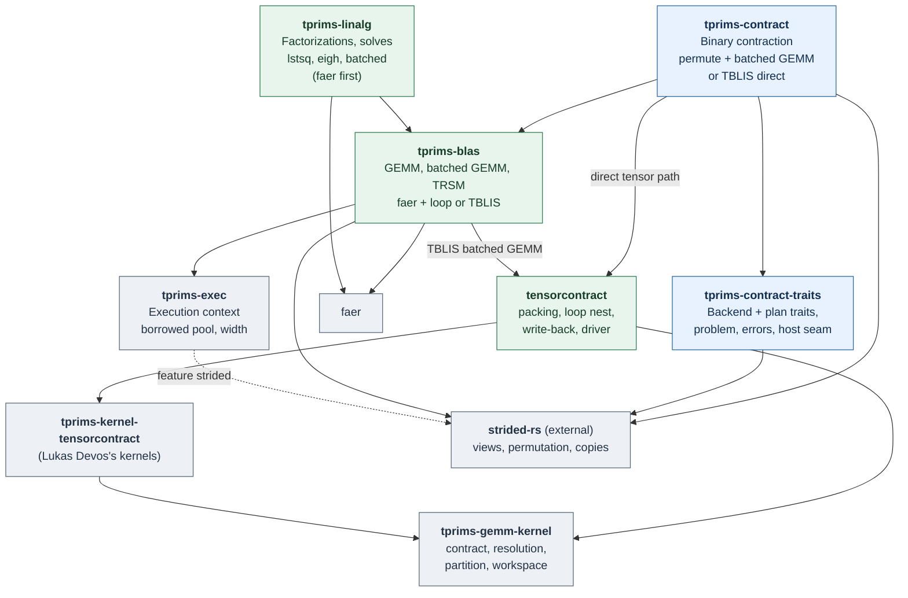
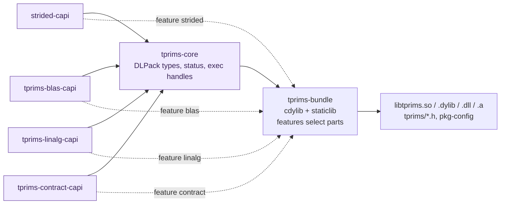

# tprims-rs

An experimental design for a CPU algebra stack built from independent parts:
an explicit execution context, strided kernels, a GEMM microkernel, BLAS-like
matrix operations, dense linear algebra, and binary tensor contraction. Each
part is a separate crate that can be used on its own; there is no facade. A C
ABI can be built from any subset of parts into a single shared library,
`libtprims`, with zero-copy DLPack-compatible data exchange. AI-assisted
contributions are welcome.

**Status:** design, experiments and imported building blocks; no stable API,
ABI or performance claim. The repository holds design notes, measurement
experiments under `experiments/`, and:

- `tensorprimitives/`: tensorprimitives-rs by Lukas Devos (`tensorcontract`,
  the TBLIS-style direct contraction), imported with its history in Phase 0.
- `benchmarks/`: the `tprims-bench` package.
- `crates/`: the new `tprims-*` parts (from Phase 1).

strided-rs (`strided-view`, `-perm`, `-basic`, `-kernel`) is an external
dependency pinned to its v0.4.4 commit, the same pin as tenferro-rs.

**Design principles** ([full text](docs/design-principles.md)): parts, not a
facade; one direction of dependency; short names under the `tprims-` prefix;
a C ABI per part, linked into one library per build; zero copy through
DLPack; no hidden copies, threads or allocation; the host owns execution;
correctness before measurement, measurement before optimization.

## Parts, not a facade

**Arrows mean "depends on"** and are drawn from the manifests (`cargo tree`).
`tprims-contract` and `tprims-linalg` are siblings on top of `tprims-blas`:
a contraction needs matrix GEMM only, and a tensor factorization is the
caller reshaping a view and calling `tprims-linalg`. Every part also takes
`tprims-exec` directly. [Full dependency list](docs/architecture.md#crates).
Rust crates carry no C symbols. Each C ABI crate is an `rlib` owned by the
part it exposes; only `tprims-bundle` produces a shared or static library.



The kernel layer is its own crate set: `tprims-gemm-kernel` owns the packed
format, the kernel-family contract and the resolution, and the providers
(`tprims-kernel-tensorcontract`, and the call-only `tprims-kernel-gemm` and
`tprims-kernel-pgx86`) supply kernels.

| Crate | Owns | C ABI crate |
| --- | --- | --- |
| `tprims-exec` | Execution context: serial, a Rayon pool borrowed from the host (or created by a C host), host scheduling callbacks; width chosen from work; reusable scratch. No ambient global pool. | `tprims-core` |
| `strided-*` (external, [strided-rs](https://github.com/tensor4all/strided-rs)) | Checked strided views, scalar and conjugation contracts, copy and permutation, map / reduce / fused elementwise. | `strided-capi` (planned) |
| `tprims-gemm-kernel` | The kernel contract, with no dependencies of its own: packed formats, kernel-family descriptors, CPU masks, resolution with frozen blocking, the partition policy, the workspace provider and caller-scoped catalogs of downstream kernels. MIT OR Apache-2.0. | none |
| `tprims-kernel-tensorcontract` (imported, tensorprimitives-rs by Lukas Devos) | Lukas Devos's register-tile microkernels: scalar, AVX2, AVX-512 and NEON, with and without complex schemes. MIT OR Apache-2.0. | none |
| `tprims-kernel-gemm` | Adapter calling the MIT-licensed `gemm-f64`/`gemm-f32` microkernels as direct-update families (feature `kernel-gemm`). MIT OR Apache-2.0. | none |
| `tprims-kernel-pgx86` | Adapter calling the MIT-licensed `private-gemm-x86` as a matrix engine (feature `kernel-pgx86`, x86-64 only). MIT OR Apache-2.0. | none |
| `tensorcontract` (imported, tensorprimitives-rs by Lukas Devos) | The direct contraction driver: packing traversal, the loop nest, write-back, and the `Spmd` seam it borrows a workspace through. | none |
| `tprims-blas` | GEMM and batched GEMM (faer plus a loop over items, or TBLIS-style; compared), TRSM, later SYRK / HERK. | `tprims-blas-capi` |
| `tprims-linalg` | LU, Cholesky, LDLᴴ, QR, SVD, symmetric / Hermitian eigendecomposition; solves on factor objects, `solve`, `lstsq`, `inv`, `det`; `batched` module. faer per item first. | `tprims-linalg-capi` (Phase 2) |
| `tprims-custom-kernel-test` | Test-only downstream stand-in with its own packed kernels and a custom selector (see [architecture](docs/architecture.md#custom-kernels-with-a-safe-selector)); not part of the stack. | none |
| `tprims-contract-traits` | The implementation-independent contraction interface: problem and validation, shared errors, object-safe backend / prepared-plan traits and a minimal borrowed host-execution seam; `tprims-contract` implements it, other backends can too. No executor runtime or kernel layer. | none |
| `tprims-contract-testkit` | Test-only second backend (naive loop nest) used to prove the interface; not a production fallback. | none |
| `tprims-contract` | Binary contraction with batch indices (`dot_general` semantics) with two strategies to compare: permute plus batched GEMM (from tenferro-rs) and TBLIS-style direct (from tensorprimitives-rs); thin permute / add / trace wrappers. | `tprims-contract-capi` |

Crate, header and symbol names map one to one: `tprims-blas` exposes
`tprims/blas.h` and `tprims_blas_*`. A Rust user who prefers short paths can
rename on import, for example `blas = { package = "tprims-blas" }`.

**Deliberately excluded:** N-ary einsum and contraction-order planning (they
stay above the stack, in the published `strided-opteinsum` releases or the
frontend, and call `tprims-contract` per binary step); iterative Krylov solvers (deferred, see the
[decision log](docs/decision-log.md)); AD, tracing, device transfer and GPU
backends.

## One shared library from the parts you need



```sh
cargo build --release -p tprims-bundle --features blas,contract
```

Every part links into one library, so handles such as an executor created by
`tprims_exec_rayon_create` are valid in every other part's calls. Separate
per-part shared libraries are not supported: they would duplicate Rust types,
Rayon runtimes and, for static libraries, the Rust standard library symbols.
A 2026-09-29 local prototype confirmed that `#[no_mangle]` functions defined
in feature-selected `rlib` dependencies are exported from the bundle and that
a handle created by one part is accepted by another.

## Zero-copy data exchange with DLPack

- Operands are borrowed `DLTensor*` descriptors: data pointer, `byte_offset`,
  shape and element strides, including column-major and negative strides. No
  input is copied at the boundary, so NumPy, PyTorch, JAX and Julia arrays
  pass through unchanged.
- Results are written either into a caller-provided `DLTensor`
  (`C = alpha * op(A, B) + beta * C`) or returned as a library-allocated
  `DLManagedTensorVersioned` (DLPack 1.x) with a deleter, for outputs whose
  size the library determines, such as factors.
- Conjugation is a per-operand argument because DLPack has no conjugation
  flag. Every operand is a borrowed `tprims_tensor` (the `DLTensor*` view plus DLPack flags), so a `READ_ONLY` versioned tensor can be detected and is rejected as an output before any write.
- If a stride layout would require internal materialization, the call reports
  the selected strategy; `TPRIMS_NO_MATERIALIZE` turns that case into an
  error instead of a hidden copy.

## Caller-owned execution

```c
tprims_exec *tprims_exec_serial(void);
tprims_exec *tprims_exec_rayon_create(size_t nthreads, const tprims_rayon_opts *opts);
tprims_exec *tprims_exec_from_callbacks(const tprims_exec_vtable *host);
size_t       tprims_exec_num_threads(const tprims_exec *exec);
tprims_status tprims_exec_set_budget(tprims_exec *exec, size_t max_threads);
tprims_status tprims_exec_close(tprims_exec *exec);   /* owned pool: joins workers */
void         tprims_exec_retain(tprims_exec *exec);
void         tprims_exec_release(tprims_exec *exec);
```

Every expensive operation takes an explicit `tprims_exec`. Rust callers pass an `Exec` that borrows the host's Rayon pool, for example the pool of tenferro-rs, for the duration of the call. Serial work runs on the calling thread without entering any pool; only a kernel that runs in parallel enters the pool, and not at all if the caller is already one of its workers. With that rule an entry cost of about 10 µs is acceptable ([measurement](experiments/rayon-entry/README.md)): work below roughly 50 to 100 µs runs serially, and a kernel picks its width from its work so that full-width fan-out (55 to 200 µs at 18 threads) is paid only by large kernels ([cost model](docs/architecture.md#cost-of-parallel-execution)). faer can therefore serve as the first backend. `close` of a pool created through the C ABI is synchronous: dropping a Rayon `ThreadPool` only terminates threads asynchronously, so the handle keeps each worker's `JoinHandle` and joins them, returning `TPRIMS_BUSY` while work is in flight. Closing a context that borrows a host pool never stops the host's threads. [Details](docs/architecture.md#execution-context).

## Two contraction strategies, compared

`tprims-contract` ports two existing implementations behind one plan API: tenferro-rs's permute plus batched GEMM, and the [TBLIS](https://arxiv.org/abs/1607.00291)-style direct contraction of Lukas Devos's [tensorprimitives-rs](https://github.com/lkdvos/tensorprimitives-rs), which packs general strides straight into microkernel panels and scatters output tiles. Batched GEMM likewise has two implementations, faer plus a loop over items and the TBLIS-style kernel. Measurement decides which one a plan selects for which shapes. Ported code keeps its authorship, history and license notices.

## Phase 0: one repository

strided-rs, tensorprimitives-rs and strided-rs-benchmark-suite were imported
with `git subtree` (history kept) into one Cargo workspace, and the
repository and performance rules were ported from tenferro-rs. strided-rs and
its benchmarks later went back to their own repositories: only one small
adapter had needed strided changes, and a second copy of strided would have
diverged from the one tenferro-rs uses
([`REPOSITORY_RULES.md`](REPOSITORY_RULES.md),
[`PERFORMANCE_TIPS.md`](PERFORMANCE_TIPS.md)).

## Phase 1: a tenferro-rs CPU backend

Every step adds benchmarks to `tprims-bench`, measured at 1 and 4 threads in
the same run.

| Step | Content |
| --- | --- |
| 1a | `tprims-exec`: borrowed pool, width from work, kernel-level entry, `broadcast(n, f)` |
| 1b | `tprims-blas`: GEMM, batched GEMM (faer + loop, TBLIS), grouped GEMM (1e-0), TRSM |
| 1c | `tprims-contract`: permute + batched GEMM and TBLIS direct, compared |
| 1d | `tprims-linalg`: faer per item plus batched loops, covering tenferro's CPU linear algebra including nonsymmetric `eig` |
| 1e | tenferro-rs integration behind a feature, with an explicit per-op fallback to the current backend, A/B correctness and a same-run performance gate |
| 1f | A thin C ABI slice (core, blas, contract, bundle) and C benchmarks, to test the design across the C boundary early |

**Status (2026-09-30):** 1a, 1b, 1c, 1d and 1f are implemented
(`crates/tprims-{exec,blas,linalg,contract,core,blas-capi,contract-capi,bundle}`),
each with 1T/4T benchmarks under [`benchmarks/benchmarks/tprims/`](benchmarks/benchmarks/tprims/README.md)
and [`benchmarks/c/`](benchmarks/c/README.md). 1e (tenferro-rs integration,
[design](docs/superpowers/specs/2026-09-30-phase1e-tenferro-integration-design.md))
is in progress: the tenferro injection points and the optional tprims
providers (GEMM, `dot_general`, linalg kernels) are merged in tenferro-rs
(#1954, #1955) and selectable in tenferro-benchmark (`--features tprims`);
on tenferro's shape corpus `Strategy::Auto` now contracts TBLIS-style when
permute+GEMM would copy an operand (decision log). Optimizing tprims itself
comes next, starting with a switchable GEMM engine
([#23](https://github.com/tensor4all/tprims-rs/issues/23)); acceptance runs
in tenferro-benchmark are deferred until then.

Full C ABI coverage is Phase 2. [Full plan](docs/architecture.md#implementation-order).

The motivating [FFI measurement](https://github.com/tensor4all/tenferro-rs/issues/1945)
reported roughly 8 to 14 µs session entry on one EPYC configuration. It is a
measured case to investigate, not a general FFI cost or a result of this
project.

Read the [design principles](docs/design-principles.md),
[detailed design](docs/architecture.md),
[experiment protocol](docs/experiments.md),
[research map](docs/research-map.md) and [decision log](docs/decision-log.md).
Contributions should include attributable sources, numerical checks and
reproducible evidence for performance claims; see the
[provenance policy](docs/provenance.md).

tensorprimitives-rs was imported with history in Phase 0
([provenance](docs/provenance.md)); imported code keeps its own licenses. No crate has been published from this repository. The
license of the new tprims code is pending a maintainer choice.

## Acknowledgements and citation

tprims builds on [faer](https://github.com/sarah-quinones/faer-rs) by Sarah
Quiñones El Kazdadi: `tprims-blas` and `tprims-linalg` run their GEMM,
factorizations and eigensolvers through faer, and GEMM kernels ported from
faer's ecosystem keep their copyright and MIT license notices. If you use
tprims in published work, please also cite the faer paper:

> S. Q. El Kazdadi, "faer: A linear algebra library for the Rust programming
> language", *Journal of Open Source Software* **11**(123), 6099 (2026),
> [doi:10.21105/joss.06099](https://doi.org/10.21105/joss.06099).

```bibtex
@article{Kazdadi2026,
  doi = {10.21105/joss.06099},
  url = {https://doi.org/10.21105/joss.06099},
  year = {2026},
  publisher = {The Open Journal},
  volume = {11},
  number = {123},
  pages = {6099},
  author = {Kazdadi, Sarah Quiñones El},
  title = {faer: A linear algebra library for the Rust programming language},
  journal = {Journal of Open Source Software}
}
```

Other upstream works and their licenses are credited in
[docs/provenance.md](docs/provenance.md).
